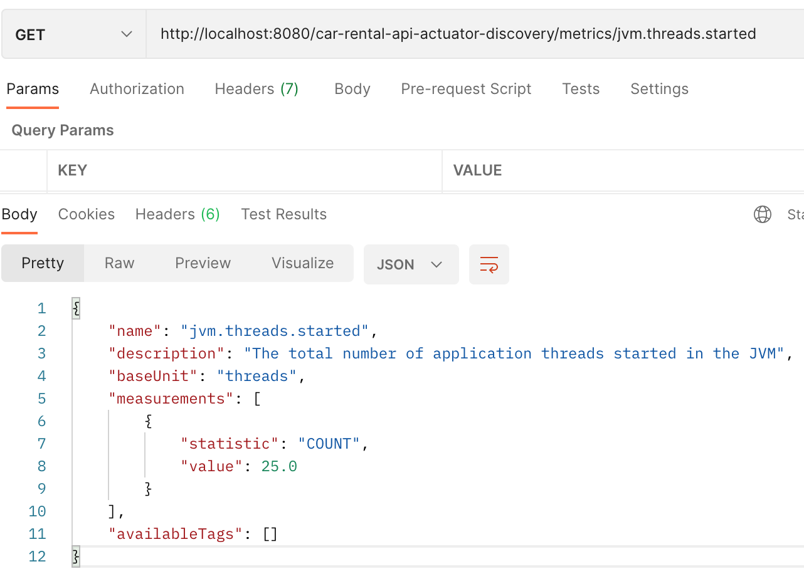

This is a draft project to play with observability && monitoring configs.

## Prerequisites

* `Spring MVC` is used as core to build modules
* `Spring Boot Actuator` is a metric collector/registry
* `Micrometer` is a facade for monitoring systems and metric aggregation tools (Prometheus)
* `Prometheus` as a metrics aggregation tool
* `Loki` is a log aggregation tool that receives the logs from our application and indexes the logs to be visualized using Grafana
* `Grafana` helps to visualize the metrics by building different dashboards. References to Prometheus to 
* `Tempo` is used as a distributed tracing tool, which can track requests that span across different systems
* `Docker` used for containerized builds

## Theory

Observability is the ability to observe the internal state of a running system from the outside. It consists of the 
three pillars - **logging, metrics and traces**.

For metrics and traces, Spring uses `Spring Boot Actuator`. For logging ...

### Metrics and Traces | Spring Boot Actuator

Actuator brings production-ready features to our application: monitoring our app, gathering metrics, and understanding 
traffic or the state of our database becomes trivial with this dependency.

The main benefit of this library is that we can get production-grade tools without actually having to implement these 
features ourselves.

The actuator mainly exposes operational information about the running application — health, metrics, info, dump, env, etc.
It uses HTTP endpoints or JMX beans to enable us to interact with it.

##### Actuator: 1.x vs 2.x

Spring Boot Actuator has been available since April 2014, together with the first Spring Boot release. With the release 
of Spring Boot 2, Actuator has been redesigned, and new exciting endpoints were added, this makes a breaking changes: 

* 2.x Actuator become technology-agnostic by using [Micrometer Observation](https://micrometer.io/docs/observation),
Actuator 1.x is tied to MVC and, therefore, to the Servlet API. In 2.x Actuator the in-house metrics were replaced with 
Micrometer support, so we can expect breaking changes. If our application were using metric services such as GaugeService
or CounterService, they would no longer be available. We will interact with Micrometer directly.

* 2.x Actuator security model is merged with the application one, so the security can be configured in one 
place with main app.

* In 2.x, Actuator defines its model as pluggable and extensible without relying on MVC for this. Hence, with this new 
model, we can take advantage of MVC and WebFlux as an underlying web technology. Forthcoming technologies could be added
by implementing the right adapters.

* In 2.x the Observation API has been completely reworked.

We will be using 2.x Actuator at this project.

##### Actuator: 'Discovery' endpoint and hypermedia

All Actuator endpoints are now placed under the `/actuator` path by default. We can tweak this path using the new property
`management.endpoints.web.base-path=/car-rental-api-actuator-discovery`:

In order to access all the actuator endpoints using HTTP, we need to both enable and expose them. By default, all endpoints
but `/shutdown` are enabled. Only the `/health` and `/info` endpoints are exposed by default. We need to add the following
configuration to expose all endpoints:
`management.endpoints.web.exposure.include=*`

or define a list of exposed endpoints:
`management.endpoints.web.exposure.include=health, info, beans, metrics`

All the possible endpoints are listed here: [actuator.endpoints](https://docs.spring.io/spring-boot/docs/current/reference/html/actuator.html#actuator.endpoints)

Example of requesting `/beans` endpoint, that we just have enabled:

##### Actuator: Health indicators

Out-of-the-box Spring Boot registers `DiskSpaceHealthIndicator` and `PingHealthIndicator` to report 
the healthiness of particular application aspect. Also, Spring Boot registers some indicators conditionally - if some 
dependencies are on the classpath or some other conditions are met.

Here is a full list of [auto-configured indicators](https://docs.spring.io/spring-boot/docs/current/reference/html/actuator.html#actuator.endpoints.health.auto-configured-health-indicators)

To create a custom health indicator we have to implement `HealthIndicator` interface, see `com.example.health.RandomHealthIndicator`.

Here is what `/health` endpoint returns in response when RandomHealthIndicator is created:

##### Actuator: Metrics | Micrometer

Spring Boot Actuator provides dependency management and auto-configuration for Micrometer: [Micrometer Observation](https://micrometer.io/docs/observation).

We can use Actuator to get a possible metric names from the `/metrics` endpoint. All the possible metrics are listed here.

##### Micrometer: Meter and MeterRegistry

`Meter` represents a family of metrics of one type(Gauge/Timers/Counter/Other). Spring Boot 2 configures a composite `MeterRegistry` 
to which any number of registry implementations can be added, allowing you to ship your metrics to more than one 
monitoring system - HumioPropertiesConfigAdapter, DatadogPropertiesConfigAdapter, NewRelicPropertiesConfigAdapter, and many others.

Using `CompositeMeterRegistry` provides a solution to publish application metrics to various
supported monitoring systems simultaneously. Using `MeterRegistryCustomizer` you can customize the whole set of registries
at once or individual implementations in particular. For example, a commonly requested setup is to:
* (1) export metrics to both Prometheus and CloudWatch, 
* (2) add a set of common tags to metrics flowing to both (for example, host and application identifying tags),
* (3) whitelist only a small subset of metrics to CloudWatch.

Well-known meter types/families:
* Counter: merely reports a count over a specified property of an application. Could be useful when counting a number of
method calls or number of created instances of some class. We can also use `@Counted` annotation to measure a method 
execution time in cross-cutting manner. We need to add a CountedAspect as a bean, then the metrics are created when 
calling the method.
* Timer: measures latencies or frequency of events in the system. A Timer will report at least the total time and events 
count of a specific time series. Could be useful when there is a need to measure execution time of a code/method. The 
Timer is used by `@Timed` annotation to measure execution time in cross-cutting manner.
* Gauge: reports data only when observed. Gauges can be useful when monitoring stats of cache or collections.
* DistributionSummary: tracks the sample distribution of events. An example would be the response sizes for requests 
hitting an http server.

When we use annotations `@Counted` and `@Timed`, the corresponding aspect registers the Meter of some type(COUNTER, TIMER).
We also can register the Meter(metric) programmatically like we do for Gauge (see RentalInMemoryRepository).

Here is a response with new metrics added by using annotations:

Getting Timer metric `Timed:CarRentalManagerClient.rentCar`:

Getting Counter metric `Counted:RestApiController.getCars`:

Getting Gauge metric `Gauge:RentalInMemoryRepository.storage.size`:

##### Micrometer: Observation

TODO: @Observed, ObservedAspect

##### Tracing

Distributed tracing allows you to see the entire journey of your requests throughout a distributed system. Spring Boot 
Actuator uses [Micrometer Tracing](https://micrometer.io/docs/tracing) as a trace collector.

##### Loggers

TODO 

### Visualization tools

For the sake of simplicity, we will use Prometheus as a metric-storage and Grafana as a metric-view tool. Grafana is
widely used for visualization because it provides abilities to dynamically build metric dashboards to see consolidated metric representations. Prometheus is
also providing a metric view UI, but its representational capabilities are much poorer compared to Grafana.

TODO

---
Useful links:

* https://docs.spring.io/spring-boot/docs/2.0.x/actuator-api/html/
* https://www.baeldung.com/spring-boot-health-indicators
* https://www.baeldung.com/micrometer
* https://spring.io/blog/2018/03/16/micrometer-spring-boot-2-s-new-application-metrics-collector

Samples

* https://github.com/SaiUpadhyayula/springboot3-observablity
* https://programmingtechie.com/2023/09/09/spring-boot3-observability-grafana-stack/
* https://mehmetozkaya.medium.com/monitor-spring-boot-custom-metrics-with-micrometer-and-prometheus-using-docker-62798123c714