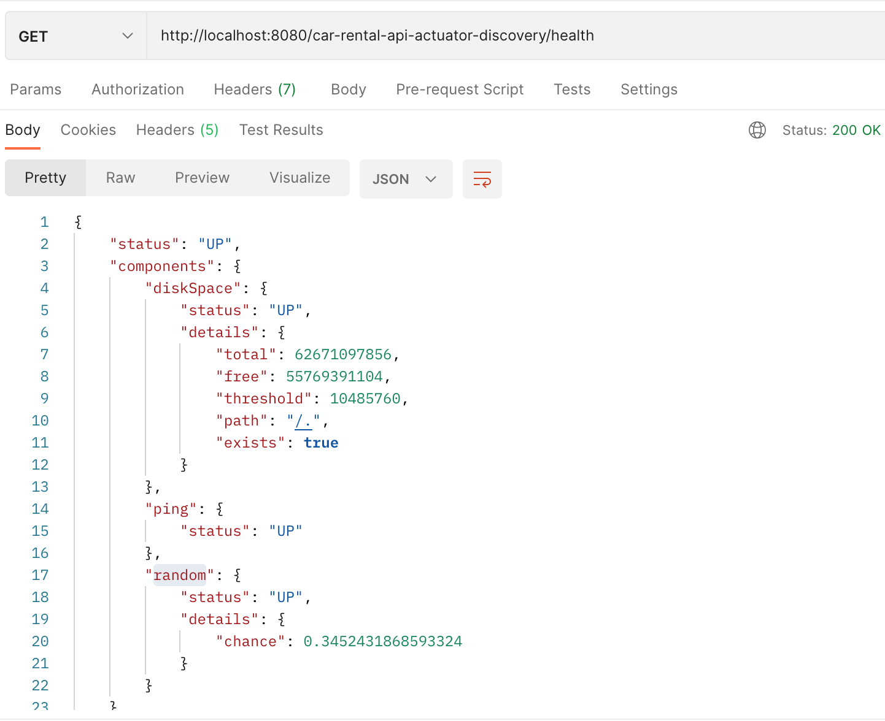
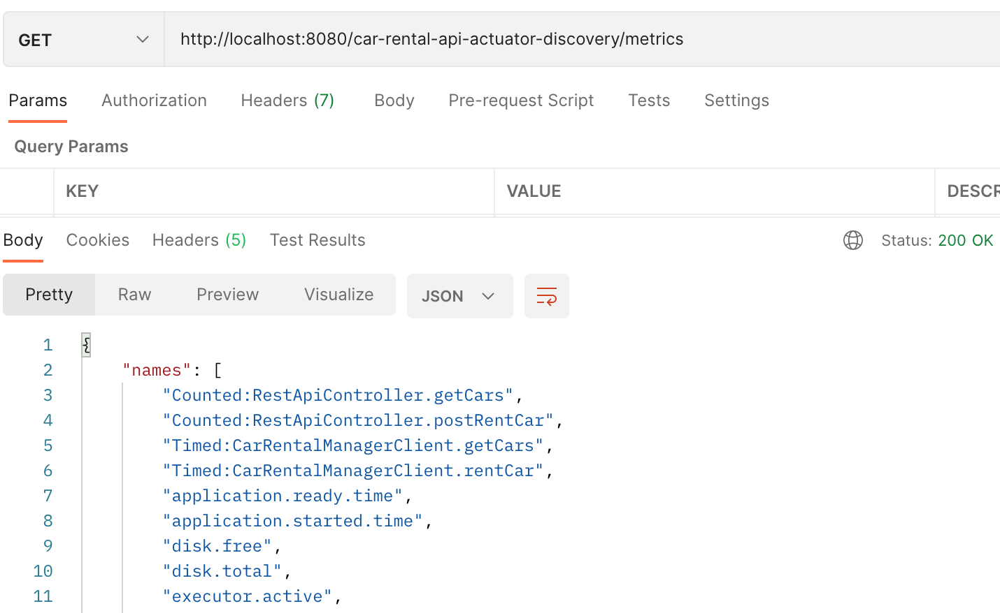

This is a draft project to play with observability && monitoring tools.

#### The App

The monitored application emulates car rental system. It is built of 2 services:
* API service `car-rental-api` on 8080 port 
* business service `car-rental-manager` on 8081 port

The API service is supposed to be called by the user to get a list of available cars, then user picks some car for rent on fixed period of time.
The business service stores a car and rent info.

At first the user has to get the list of available cars:
`GET: http://localhost:8080/car-rent-api/cars`
<p align="center"></p>

After that, the user picks some carId (b474bafe-8697-4bec-9711-aaea40d5f05f) and performs rent request:
`POST: http://localhost:8080/car-rent-api/rent`
```json
{
    "carId": "b474bafe-8697-4bec-9711-aaea40d5f05f",
    "from": "2023/12/05 22:00:00",
    "to": "2023/12/06 13:00:00"
}
```
<p align="center"></p>

Every time we call the REST API new metric and trace data is getting generated and reported to monitoring systems.

#### Prerequisites

* [Spring Web](https://docs.spring.io/spring-boot/docs/current/reference/html/web.html#web) is used as core to build modules
* [Spring Boot Actuator](https://docs.spring.io/spring-boot/docs/current/reference/html/actuator.html) provides all of Spring Boot’s production-ready monitoring features
* [Micrometer](https://micrometer.io/) is a facade for monitoring systems 
* [Prometheus](https://prometheus.io/) as a metrics collector and aggregation tool, works under Micrometer facade
* [OpenZipkin Brave](https://github.com/openzipkin/brave) - tracer and trace reporter, sends traces to Grafana-Tempo
* [Grafana-Tempo](https://grafana.com/oss/tempo/) is a trace collector, works under Micrometer facade, integrated with Grafana 
* [Grafana-Loki](https://grafana.com/oss/loki/) is a centralized log collector, integrated with Grafana
* [Grafana](https://grafana.com/oss/grafana/) helps to visualize metrics and traces by building dashboards. References to Prometheus and Tempo to get metrics and traces
* [Docker](https://www.docker.com/) used for containerized builds

For metrics we are going to use Actuator + Micrometer + Prometheus + Grafana;

For traces we are going to use Actuator + Micrometer + OpenZipkin Brave + Tempo + Grafana;

For logging we are going to use 

#### Intro

Observability is the ability to observe the internal state of a running system from the outside. It consists of the 
three pillars - **metrics, traces, and loggs**.

For metrics and traces Spring uses `Spring Boot Actuator`.

#### Metrics

Actuator brings production-ready features to our application: monitoring our app, gathering metrics, and understanding 
traffic or the state of our database becomes trivial with this dependency.

The main benefit of this library is that we can get production-grade tools without actually having to implement these 
features ourselves.

The actuator mainly exposes operational information about the running application — health, metrics, info, dump, env, etc.
It uses HTTP endpoints or JMX beans to enable us to interact with it.

##### Actuator: 1.x vs 2.x

Spring Boot Actuator has been available since April 2014, together with the first Spring Boot release. With the release 
of Spring Boot 2, Actuator has been redesigned, and new exciting endpoints were added, this makes a breaking changes: 

* 2.x Actuator become technology-agnostic. Actuator 1.x is tied to MVC and, therefore, to the Servlet API. In 2.x Actuator
the in-house metrics were replaced with Micrometer support, so we can expect breaking changes. If our application were 
using metric services such as GaugeService or CounterService, they would no longer be available. We will interact with 
Micrometer directly.

* 2.x Actuator security model is merged with the application one, so the security can be configured in one 
place with main app.

* In 2.x, Actuator defines its model as pluggable and extensible without relying on MVC for this. Hence, with this new 
model, we can take advantage of MVC and WebFlux as an underlying web technology. Forthcoming technologies could be added
by implementing the right adapters.

* In 2.x the Observation API has been completely reworked.

We will be using 2.x Actuator at this project.

##### Actuator: 'Discovery' endpoint and hypermedia

All Actuator endpoints are now placed under the `/actuator` path by default. We can tweak this path using the new property
`management.endpoints.web.base-path=/car-rental-api-actuator-discovery`:
<p align="center"></p>

In order to access all the actuator endpoints using HTTP, we need to both enable and expose them. By default, all endpoints
but `/shutdown` are enabled, and only the `/health` and `/info` endpoints are exposed. We have to add the following
configuration to expose all endpoints:
`management.endpoints.web.exposure.include=*`

or define a list of exposed endpoints:
`management.endpoints.web.exposure.include=health, info, beans, metrics`

All the possible endpoints are listed here: [actuator.endpoints](https://docs.spring.io/spring-boot/docs/current/reference/html/actuator.html#actuator.endpoints)

Example of requesting `/beans` endpoint, that we just have enabled:
<p align="center"></p>

##### Actuator: Health indicators

Out-of-the-box Spring Boot registers `DiskSpaceHealthIndicator` and `PingHealthIndicator` to report 
the healthiness of particular application aspect. Also, Spring Boot registers some indicators conditionally - if some 
dependencies are on the classpath or some other conditions are met.

Here is a full list of [auto-configured indicators](https://docs.spring.io/spring-boot/docs/current/reference/html/actuator.html#actuator.endpoints.health.auto-configured-health-indicators)

To create a custom health indicator we have to implement `HealthIndicator` interface, see `com.example.health.RandomHealthIndicator`.

Here is what `/health` endpoint returns in response when RandomHealthIndicator is created:
<p align="center"></p>

##### Actuator: Metrics | Micrometer

Spring Boot Actuator provides dependency management and auto-configuration for [Micrometer](https://micrometer.io/), an application metrics facade
that supports numerous monitoring systems: Datadog, Dynatrace, Graphite, Humio, New Relic, OpenTelemetry, Prometheus, Wavefront.

We can use Actuator to get a possible metric names from the `/metrics` endpoint:
<p align="center"></p>

##### Micrometer: Meter and MeterRegistry

Spring Boot configures a `SimpleMeterRegistry` by default.

Using `CompositeMeterRegistry` provides a solution to publish application metrics to various
supported monitoring systems simultaneously. Using `MeterRegistryCustomizer` you can customize the whole set of registries
at once or individual implementations in particular. For example, a commonly requested setup is to:
* (1) export metrics to both Prometheus and CloudWatch, 
* (2) add a set of common tags to metrics flowing to both (for example, host and application identifying tags),
* (3) whitelist only a small subset of metrics to CloudWatch.

`Meter` represents a family of metrics of one type(Gauge/Timers/Counter/Other). 

Well-known meter types/families:
* Counter: merely reports a count over a specified property of an application. Could be useful when counting a number of
method calls or number of created instances of some class. We can also use `@Counted` annotation to measure a method 
execution time in cross-cutting manner. We need to add a CountedAspect as a bean, then the metrics are created when 
calling the method.
* Timer: measures latencies or frequency of events in the system. A Timer will report at least the total time and events 
count of a specific time series. Could be useful when there is a need to measure execution time of a code/method. The 
Timer is used by `@Timed` annotation to measure execution time in cross-cutting manner.
* Gauge: reports data only when observed. Gauges can be useful when monitoring stats of cache or collections.
* DistributionSummary: tracks the sample distribution of events. An example would be the response sizes for requests 
hitting an http server.

When we use annotations `@Counted` and `@Timed`, the corresponding aspect registers the Meter of some type(COUNTER, TIMER).
We also can register the Meter programmatically like we do for Gauge (see RentalInMemoryRepository).

Here is a response with new metrics added by using annotations:
<p align="center"></p>

Getting Timer metric `Timed:CarRentalManagerClient.rentCar`:
<p align="center"></p>

Getting Counter metric `Counted:RestApiController.getCars`:
<p align="center"></p>

Getting Gauge metric `Gauge:RentalInMemoryRepository.storage.size`:
<p align="center"></p>

##### Metric collectors and monitoring platforms 

`Prometheus` plays a role of collector suitable to store metrics and aggregate metrics. Prometheus focuses on data acquisition,
allowing users to select and aggregate time series data in real time. We will be using Prometheus to collect the metrics, 
just the new dependency should be added: `io.micrometer:micrometer-registry-prometheus`. This creates Prometheus client 
working under Micrometer facade.

<p align="center"></p>

`Grafana` is complete platform for visualizing and analyzing time series data - metrics and traces. Here we can build
dashboards of metrics at runtime. Grafana is widely used in microservice architectures. We will be using Grafana to visualize 
metrics reported to Prometheus by Micrometer.

<p align="center"></p>

Sometimes the combination of Prometheus and Grafana could be replaced by [InfluxDB and Chronograf](https://www.influxdata.com/).

#### Traces

Distributed tracing allows you to see the entire journey of your requests throughout a distributed system.

Before Spring Boot 3 introduced we used to add the Spring Cloud Sleuth dependency to get distributed tracing capabilities to our
application, but starting from Spring Boot 3 Spring Cloud Sleuth lib is no longer needed and this is replaced by the Spring Boot
Actuator using [Micrometer Tracing](https://micrometer.io/docs/tracing), which is as a tracing facade.

If you are new to tracing, we need to quickly define a couple of basic terms. You can wrap any operation in a `span`. It has
a unique `span id` and contains timing information and some additional metadata (key-value pairs). Because you can produce
child spans from spans, the whole tree of spans forms a `trace` that shares the same `trace id` (that is, a correlation identifier).

In most cases the tracing is configured automatically by adding dependencies.

##### Tracers

Supported Tracers:
* [OpenTelemetry Specification](https://opentelemetry.io/) - [OpenTelemetry protocol](https://opentelemetry.io/docs/specs/otel/protocol/) 
by dependency `io.micrometer:micrometer-tracing-bridge-otel`. Supported tracers: Datadog, Dynatrace, Jaeger, New Relic.
* [OpenZipkin Brave](https://github.com/openzipkin/brave) - by dependency `io.micrometer:micrometer-tracing-bridge-brave`.
* [OpenTracing Specification](https://opentracing.io/) - is considered to be archived, so projects smoothly migrate to 
OpenTelemetry. Supported tracers: Jaeger, New Relic, Zipkin.

Bridge dependency gives us the Tracer for programmatic/manual tracing, so we will be able to create spans & traces programmatically.
In addition, the bridge creates a default preconfigured beans in Spring application context so that we will use the tracer
by convention.

We will be using `Zipkin` Tracer to create traces.

##### Reporters

Micrometer uses the concept of Reporter to export traces via HTTP/RPC to some destination collector:
* Wavefront reporter by dependency `io.micrometer:micrometer-tracing-reporter-wavefront`
* OpenZipkin Zipkin Brave reporter by dependency `io.zipkin.reporter2:zipkin-reporter-brave`
* OpenZipkin Zipkin exporter with OpenTelemetry by dependency `io.opentelemetry:opentelemetry-exporter-zipkin`
* OpenZipkin URL sender by dependency `io.zipkin.reporter2:zipkin-sender-urlconnection`

We will be using `OpenZipkin Zipkin Brave` Reporter to export traces.

##### Trace collectors and monitoring tools

Having chosen a tracer and reporter, we need to decide what's the destination to report and collect traces. The most famous
trace collectors are: [Jaeger](https://www.jaegertracing.io/), [Zipkin](https://zipkin.io/), and [Grafana Tempo](https://grafana.com/oss/tempo/).
Here is a comparison guide [Jaeger vs Zipkin vs Grafana Tempo](https://codersociety.com/blog/articles/jaeger-vs-zipkin-vs-tempo)
that will help to get the right collector.

We will be using `Grafana Tempo` Collector. Tempo can be easily integrated with Grafana, we can build dashboards with traces:
<p align="center"></p>

##### Create traces and spans

This setup automatically creates traces only for HTTP requests coming into controllers. We can customize this behaviour 
by creating spans and traces programmatically in any place we want. Another way is to use `@NewSpan` and `@ContinueSpan` 
annotations. To enable annotations we have to declare the `SpanAspect` bean in Spring Application Context. 

Here I have marked the methods of CarRentalManagerClient by `@NewSpan` and new traces were created:
<p align="center"></p>

#### Centralized Logging

The idea of centralized logging is that the log output of all your applications/services is sent to a central database, 
which gives you a complete picture of the logs for a single request that was processed by several servers. To identify 
corresponding log entries, there is also metadata sent with ever log output. The most important metadata are the 
`traceId` and the `serverName`. The `traceId` identifies logging entries on different servers that belong to the same 
unit of work, e.g. a request being processed. By the `serverName` you can see on which machines the request was processed.

Since we have Micrometer Tracing on the classpath and we are using Grafana, we just need to ship the logs. Let's use [Grafana Loki](https://grafana.com/oss/loki/).
To enable Loki we have to add the new dependency `com.github.loki4j:loki-logback-appender`.

I have configured Loki to write logs in fixed format. Grafana is configured to get logs from Loki:

<p align="center"></p>

There are alternative logging tools that could replace Loki sometimes: [Logstash](https://www.elastic.co/logstash) and [Graylog Open](https://graylog.org/products/source-available/).

#### Instrumentation with Micrometer

Instrumentation is the most powerful feature of Micrometer. **The idea is to shift our focus from how we want to observe
to what we want to observe.** We don’t need to think about low-level abstractions like Timer, Counter, or Gauge to measure
something, we just need to tell what we want to observe using the Observation API.

Micrometer Observation API is a new type of API that allows us to hide low level APIs such as metrics, logging, and tracing.
Instead, we have a new concept called `Observation`. Now we just want to observe that something happened in our system,
and based on that, we may add metrics, logs, or traces. And because it is just a facade for low level API we can still
expose metrics to monitoring systems.

##### Instrumentation: ObservationHandler

Ok, so now we can focus on our intent, and this is very good, but how can we get some metrics, logs, or traces if all 
that we did is just added observation? This is where the `ObservationHandler` comes in. All we need to do now is to register
a specific instance of the handler in the `ObservationRegistry`.

There are a couple of ObservationHandlers already provided for us: 
* DefaultMeterObservationHandler creates Timer and Counter metrics for our observation
* DefaultTracingObservationHandler creates traces on start and on stop
* ObservationTextPublisher creates logs on start and on stop
* CompositeObservationHandler to use multiple handlers for one observation

`DefaultMeterObservationHandler` is automatically registered on the `ObservationRegistry`, which creates metrics for 
every completed observation. At this point we can use [Observation API](https://spring.io/blog/2022/10/12/observability-with-spring-boot-3) to create observations [programmatically](https://softwaremill.com/new-micrometer-observation-api-with-spring-boot-3/#how-to-use-this-api).

##### Instrumentation: AOP Observations

Usually, creating observations programmatically mixes up the code a lot. Using the AOP to declare observations in a 
cross-cutting manner makes the code much clearer.

After declaring the `ObservedAspect` we can mark observed public methods by `@Observed` annotation. This means that annotated
methods are instrumented by `Observation` and the method's class is wrapped by a proxy that contains metrics.

We are just using the DefaultMeterObservationHandler and I have marked the CarRentManager.rentCar() method. Here are 
metrics generated by ObservedAspect:

<p align="center"></p>

#### Build

To build the application run these commands from project root:
* `mvn clean package`
* `docker-compose up`

#### Accessibility

* `car-rental-api rest api` - [http://localhost:8080/car-rent-api](http://localhost:8080/car-rent-api)
* `car-rental-manager rest api` is not supposed to be used by user
* `actuator rest api` for car-rental-api - [http://localhost:8080/car-rental-api-actuator-discovery](http://localhost:8080/car-rental-api-actuator-discovery)
* `actuator rest api` for car-rental-manager - [http://localhost:8081/car-rental-manager-actuator-discovery](http://localhost:8081/car-rental-manager-actuator-discovery)
* `prometheus ui` - [http://localhost:9090](http://localhost:9090)
* `grafana ui` - [http://localhost:3000](http://localhost:3000)

#### Useful links

https://java-online-training.de/?p=59

https://programmingtechie.com/2023/09/09/spring-boot3-observability-grafana-stack/

https://spring.io/blog/2022/10/12/observability-with-spring-boot-3

https://piotrminkowski.com/2023/07/05/logging-in-spring-boot-with-loki/

https://softwaremill.com/new-micrometer-observation-api-with-spring-boot-3/

https://openvalue.blog/posts/2022/12/16/tracing-in-spring-boot-2-and-3/
